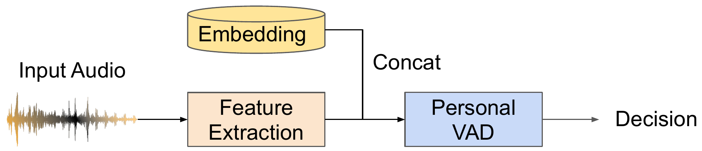
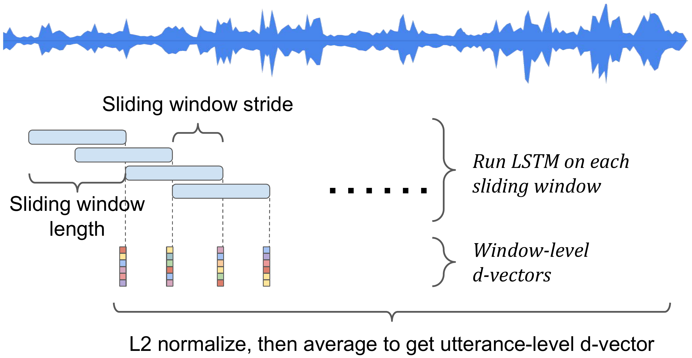
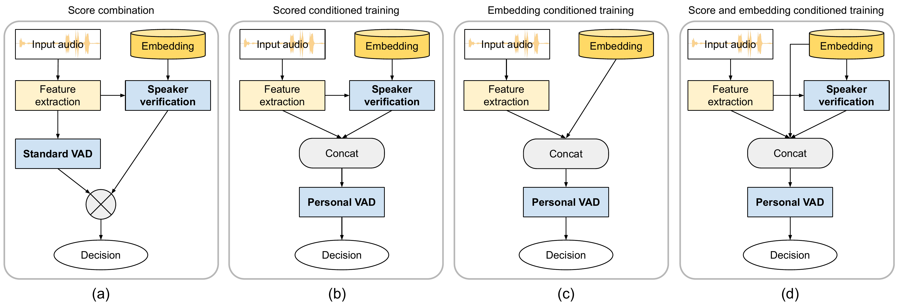
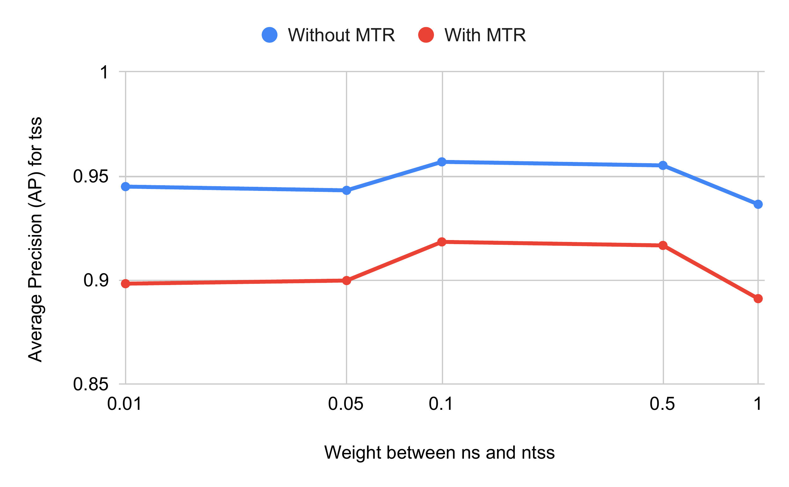
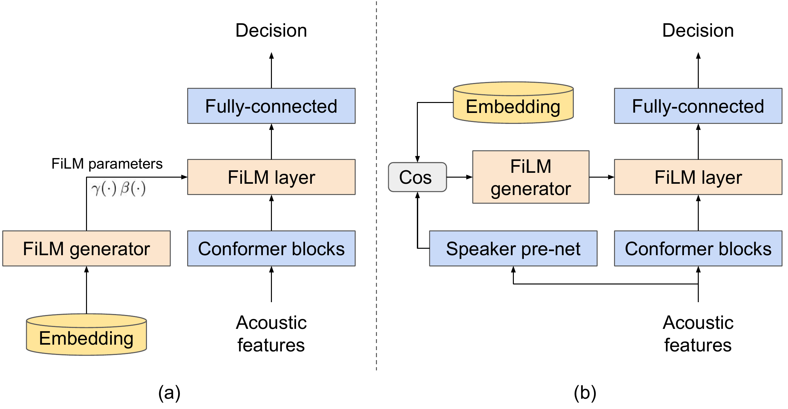

# Personal VAD (Speaker-Conditioned Voice Activity Detection)

[](https://github.com/wq2012/personal_vad/actions/workflows/pythonapp.yml)
[](https://huggingface.co/spaces/wq2012/personal_vad)
[](https://huggingface.co/wq2012/personal-vad-v2-conformer-film-dvector-cos)
[](https://pypi.org/project/personal-vad/)
[](https://pypi.org/project/personal-vad/)
[](https://www.pepy.tech/projects/personal-vad)

**This is not an officially supported Google product.**

## Introduction

This repository provides a standalone, open-source Python reproduction of
**Personal VAD 1.0** and **Personal VAD 2.0** based on the Odyssey 2020 and
Interspeech 2022 papers:

> **Personal VAD: Speaker-Conditioned Voice Activity Detection**
> *Shaojin Ding, Quan Wang, Shuo-yiin Chang, Li Wan, Ignacio Lopez Moreno*
> Paper: [https://arxiv.org/pdf/1908.04284](https://arxiv.org/pdf/1908.04284) | Interactive Demo: [Hugging Face Space (`wq2012/personal_vad`)](https://huggingface.co/spaces/wq2012/personal_vad) | Blog Page: [https://google.github.io/speaker-id/publications/PersonalVAD/](https://google.github.io/speaker-id/publications/PersonalVAD/)

> **Personal VAD 2.0: Optimizing Personal Voice Activity Detection for On-Device Speech Recognition**
> *Shaojin Ding, Rajeev Rikhye, Qiao Liang, Yanzhang He, Quan Wang, Arun Narayanan, Tom O'Malley, Ian McGraw*
> Paper: [https://arxiv.org/pdf/2204.03793](https://arxiv.org/pdf/2204.03793) | Pretrained Models: [Hugging Face Hub (`wq2012`)](https://huggingface.co/wq2012)

> [!NOTE]
> **Open-Source Reproduction Notice**: This library is an independent
> open-source reproduction of the published papers above. It does **not** use
> the original internal codebase used in the papers, which relied on Google's
> proprietary software infrastructure (including internal acoustic frontends,
> proprietary room simulators, 8-language vendor-collected d-vector encoders,
> and internal streaming on-device ASR evaluation pipelines). Instead, all
> modules, training scripts, evaluation suites, and pretrained checkpoints in
> this repository are newly implemented from scratch using open-source
> [`lingvo`](https://github.com/tensorflow/lingvo) and `tensorflow`, and trained
> on the open-source 8-language **Multilingual LibriSpeech (MLS)** corpus (`de`,
> `en`, `es`, `fr`, `it`, `nl`, `pl`, `pt`).

**Personal VAD** detects frame-level voice activity of a specific **target
speaker** in multi-speaker and noisy acoustic environments, serving as a
lightweight on-device gatekeeper before downstream speech recognition (ASR).
Unlike standard VAD, which classifies each audio frame into two classes
(`Speech` vs. `Silence`), Personal VAD classifies each frame into three classes:

- **`0`: `SPEECH` (`tss`)** — Target Speaker Speech
- **`1`: `SILENCE` (`ns`)** — Non-Speech / Silence
- **`2`: `SPEECH_FROM_NON_TARGET_SPEAKER` (`ntss`)** — Non-Target Speaker Speech

<p align="center">
  
  &nbsp;&nbsp;&nbsp;
  
</p>

---

## Architecture & Features

### 1. Personal VAD 1.0 Conditioning Architectures (`SC`, `ST`, `ET`, `SET`)

<p align="center">
  
</p>

- **`SC` (Score Combination Baseline)**: Runs a standard 2-class VAD and
  frame-level speaker verification independently, rescaling the cosine
  similarity score via online 5th/95th histogram percentiles
  (`OnlinePercentileValue`) to split speech probability into `tss` and `ntss`.
- **`ST` (Score-Conditioned Training)**: Concatenates 40-D log-Mel features and
  frame-level speaker verification cosine similarity `[x_t, s_t]` (41-D input)
  into a 2-layer 64-unit unidirectional LSTM.
- **`ET` (Embedding-Conditioned Training)**: Concatenates 40-D log-Mel features
  and the 256-D enrolled target speaker d-vector `[x_t, e_target]` (296-D input)
  into a 2-layer 64-unit unidirectional LSTM (`129,795` parameters, `262 KB`
  quantized TFLite), eliminating the runtime speaker verification network.
- **`SET` (Score and Embedding Conditioned Training)**: Concatenates acoustic
  features, target d-vector, and frame-level cosine score
  `[x_t, e_target, s_t]` (297-D input).
- **Weighted Pairwise Loss (`WPL`)**: Prioritizes `<tss, ns>` and `<tss, ntss>`
  decision boundaries (`weight = 1.0`) over `<ns, ntss>` (`weight = 0.1`).

<p align="center">
  
</p>

### 2. Personal VAD 2.0 Conformer, FiLM Modulation & Speaker Pre-Net (`B1`, `B2`, `B0`, `E0`, `E1`, `E2`, `E3`, `E5`)

<p align="center">
  
</p>

- **Stacked Log-Mel Acoustic Frontend**: Extracts 128-dimensional log-Mel
  filterbank energies (32ms window, 10ms step), stacks 4 contiguous frames
  (3 left-context frames + current frame = 512-D), and subsamples by a factor
  of 3 (30ms output frame step).
- **Causal Streaming Conformer Backbone**: 4-layer causal Conformer
  (`model_dim=64`, `num_heads=8`, `left_context=31`, `right_context=0`,
  depthwise conv `kernel_size=7`, `ffn_multiplier=8`), supporting both
  full-sequence training and stateful frame-by-frame streaming inference
  (`stream_step`).
- **Advanced Speaker Conditioning**:
  - `FILM_DVECTOR` (**Architecture E1**): Feature-wise Linear Modulation (FiLM)
    after the Conformer backbone using affine scale and shift parameters
    generated from the target speaker d-vector `e_target`.
  - `FILM_COS` (**Architecture E2**): A 2-layer Conformer **Speaker Pre-Net**
    predicts frame-level speaker embeddings `e_prenet`, computes cosine
    similarity `s_t = cos(e_prenet, e_target)`, and modulates the main
    Conformer output via FiLM.
  - `FILM_DVECTOR_COS` (**Architecture E3**): Concatenates both
    `[e_target, s_t]` and feeds the combined vector into the FiLM generator.
- **Unified Enrolled & Enrollment-Less Training (Algorithm 1, Architecture E5)**:
  During training, with probability `p_0 = 0.2`, replaces `e_target` with a
  zero vector `0` and maps `ntss` labels to `tss`, allowing a single on-device
  model to operate as both a speaker-conditioned Personal VAD and an
  enrollment-less Standard VAD.

---

## Installation

Install from PyPI:

```bash
pip3 install personal-vad
```

Or install from source:

```bash
git clone https://github.com/wq2012/personal_vad.git
cd personal_vad
pip3 install -r requirements.txt
pip3 install -e .
```

---

## Quick Start: Pretrained Model Inference (`personal_vad.load_pretrained`)

All 13 pretrained models are hosted on Hugging Face Hub under
[`wq2012`](https://huggingface.co/wq2012) and can be loaded directly by repo ID
or local directory path:

```python
import personal_vad

# 1. Load a pretrained Personal VAD 2.0 model from Hugging Face Hub or local dir
engine = personal_vad.load_pretrained(
    "wq2012/personal-vad-v2-conformer-film-dvector-cos"
)

# 2. Run speaker-conditioned inference on 16kHz WAV files (or NumPy arrays)
result = engine.infer_From_files(
    audio_path="conversation_16k.wav",
    enroll_path="target_speaker_enroll_16k.wav",
    threshold=0.5,
    output_filtered_wav="target_speaker_only.wav",
)

print("Frame timestamps (s):", result["frame_times_sec"].shape)
print("Frame posteriors [tss, ns, ntss]:", result["probabilities"].shape)
print("Target speech ratio:", result["target_mask"].mean())

# 3. Enrollment-less Standard VAD fallback (Architecture E5 with zero d-vector)
unified_engine = personal_vad.load_pretrained(
    "wq2012/personal-vad-v2-conformer-unified"
)
std_vad_result = unified_engine.infer_From_files(
    audio_path="conversation_16k.wav",
    enroll_path=None,  # Uses zero vector e_target = 0 (Algorithm 1)
)

# 4. On-device 8-bit Quantized TFLite inference
tflite_result = engine.infer_From_files(
    audio_path="conversation_16k.wav",
    enroll_path="target_speaker_enroll_16k.wav",
    use_tflite=True,
    quantized=True,
)
```

Or run from the command line using `scripts/inference.py` (or `pvad-inference`):

```bash
python3 scripts/inference.py \
  --model wq2012/personal-vad-v2-conformer-film-dvector-cos \
  --audio_wav conversation_16k.wav \
  --enroll_wav target_speaker_enroll_16k.wav \
  --output_wav target_speaker_only.wav \
  --output_json predictions.json
```

---

## Pretrained Models on Hugging Face Hub (`wq2012`) & Benchmark Results

### 1. Original Paper Reference Benchmarks

#### Personal VAD 1.0 Reference Results ([arXiv:1908.04284](https://arxiv.org/pdf/1908.04284), Table 1 & Table 2)

Average Precision (AP) and micro-averaged mean Average Precision (`mAP`) on
concatenated LibriSpeech test utterances (clean vs. multistyle training `MTR`
room reverberation + noise):

| Method | Loss | Without MTR `tss` | Without MTR `ns` | Without MTR `ntss` | Without MTR `mAP` | With MTR `tss` | With MTR `ns` | With MTR `ntss` | With MTR `mAP` | Parameters |
| :--- | :---: | :---: | :---: | :---: | :---: | :---: | :---: | :---: | :---: | :---: |
| **SC (baseline)** | N/A | 0.886 | 0.970 | 0.872 | 0.900 | 0.777 | 0.908 | 0.768 | 0.801 | 4.88M (SV) + 0.06M (VAD) |
| **ST** | CE | 0.956 | 0.968 | 0.956 | 0.957 | 0.905 | 0.885 | 0.905 | 0.901 | 4.88M (SV) + 0.06M (PVAD) |
| **ET** | CE | 0.932 | 0.962 | 0.946 | 0.946 | 0.878 | 0.873 | 0.890 | 0.883 | **0.13M (PVAD)** |
| **SET** | CE | **0.970** | 0.969 | 0.972 | **0.969** | **0.938** | 0.888 | 0.938 | **0.928** | 4.88M (SV) + 0.13M (PVAD) |
| **ET** | **WPL** | 0.955 | 0.965 | 0.961 | 0.959 | 0.916 | 0.883 | 0.920 | 0.912 | **0.13M (PVAD)** |

Standard VAD task evaluation on non-concatenated LibriSpeech test utterances
([arXiv:1908.04284](https://arxiv.org/pdf/1908.04284), Table 2):

| Method | Loss | Without MTR Speech (`s`) AP | Without MTR Non-Speech (`ns`) AP | With MTR Speech (`s`) AP | With MTR Non-Speech (`ns`) AP |
| :--- | :---: | :---: | :---: | :---: | :---: |
| **Standard VAD** | CE | 0.992 | 0.975 | 0.975 | 0.918 |
| **Personal VAD (ET)** | CE | 0.991 | 0.965 | 0.979 | 0.893 |
| **Personal VAD (ET)** | WPL | 0.991 | 0.967 | 0.979 | 0.901 |

#### Personal VAD 2.0 Reference Results ([arXiv:2204.03793](https://arxiv.org/pdf/2204.03793), Table 1 & Table 2)

Downstream streaming ASR Word Error Rate (`WER %`), model size, and FLOPs on
internal vendor-collected Speech Query (`Non-Concat` and `Concat`) and Voice
Search (`VS`) test sets:

| Exp | Model Architecture | Enrolled Non-Concat WER (%) | Enrolled Concat WER (%) | Enrollment-Less VS WER (%) | Enrollment-Less Non-Concat WER (%) | Size (MB) | FLOPs (M) |
| :---: | :--- | :---: | :---: | :---: | :---: | :---: | :---: |
| **B1** | LSTM Standard VAD | N/A | N/A | 7.2 | 11.5 | 1.5 | 3.41 |
| **B2** | Conformer Standard VAD | N/A | N/A | 6.9 | 10.1 | 0.7 | 8.77 |
| **B0** | Personal VAD 1.0 (3L LSTM Concat) | 17.9 | 41.0 | >= 100.0 | >= 100.0 | 5.8 | 3.54 |
| **E0** | + 4L Causal Conformer Concat | 15.3 | 31.5 | — | — | 2.8 | 9.51 |
| **E1** | + FiLM d-vector Modulation | 11.3 | 29.5 | — | — | 2.8 | 9.58 |
| **E2** | + Speaker Pre-Net (`cos`) FiLM | 11.7 | 27.5 | — | — | 4.0 | 9.51 |
| **E3** | + FiLM d-vector & Speaker Pre-Net `cos` | 11.5 | 27.6 | — | — | 4.0 | 9.58 |
| **E4** | + 8-bit Quantization (w/o Alg. 1) | 12.2 | 27.2 | >= 100.0 | >= 100.0 | 1.0 | 9.58 |
| **E5** | **Personal VAD 2.0 (w/ Alg. 1 + INT8)** | **12.4** | **32.7** | **7.0** | **10.1** | **1.0** | **9.58** |

---

### 2. Open-Source Reproduction Results on 8-Language Multilingual LibriSpeech (MLS)

All 13 open-source pretrained models were trained and evaluated on the
open-source 8-language **Multilingual LibriSpeech (MLS)** dataset (`de`, `en`,
`es`, `fr`, `it`, `nl`, `pl`, `pt`; `1,323` utterances across `142` speakers in
disjoint speaker splits: `98` train speakers / `315` unseen test utterances
across `35` unseen test speakers). The open-set 256-D speaker verification
d-vector encoder achieves an unseen-speaker verification **ROC-AUC of `0.9521`**
(mean positive cosine similarity `0.7130` vs. negative `-0.0082`).

Every model repository on Hugging Face Hub includes:
- `model.safetensors`: SafeTensors FP32 checkpoint
- `model.weights.h5`: Keras 3 weights checkpoint
- `model_fp32.tflite`: FP32 TensorFlow Lite FlatBuffer
- `model_quantized.tflite`: 8-bit dynamic-range quantized TensorFlow Lite model
- `model_config.json` & `speaker_subspace.npz`: Full model configuration and
  256-D speaker d-vector projection matrix
- `evaluation_metrics.json`: Full evaluation metrics with 95% non-parametric
  bootstrap confidence intervals

#### A. Personal VAD 1.0 Open-Source Pretrained Models (MLS Concatenated Multi-Speaker Test Set)

| Hugging Face Repository | Arch | Loss | Params | INT8 `.tflite` | Concat `tss` AP | Concat `ns` AP | Concat `ntss` AP | Concat `mAP` (95% Bootstrap CI) | INT8 `.tflite` `mAP` |
| :--- | :---: | :---: | :---: | :---: | :---: | :---: | :---: | :---: | :---: |
| [`wq2012/personal-vad-v1-sc`](https://huggingface.co/wq2012/personal-vad-v1-sc) | `SC` | CE | 64,194 | 196.4 KB | **0.9435** | **0.9604** | **0.7848** | **0.9161** (`[0.9056, 0.9277]`) | **0.9090** |
| [`wq2012/personal-vad-v1-st-ce`](https://huggingface.co/wq2012/personal-vad-v1-st-ce) | `ST` | CE | 64,515 | 197.4 KB | 0.9394 | 0.9336 | 0.7550 | 0.8834 (`[0.8668, 0.9014]`) | 0.8804 |
| [`wq2012/personal-vad-v1-et-ce`](https://huggingface.co/wq2012/personal-vad-v1-et-ce) | `ET` | CE | 129,795 | 262.4 KB | 0.9362 | 0.9536 | 0.7817 | 0.8665 (`[0.8460, 0.8897]`) | 0.8609 |
| [`wq2012/personal-vad-v1-set-ce`](https://huggingface.co/wq2012/personal-vad-v1-set-ce) | `SET` | CE | 130,051 | 262.7 KB | 0.9385 | 0.9510 | 0.7725 | 0.8469 (`[0.8237, 0.8712]`) | 0.8521 |
| [`wq2012/personal-vad-v1-et-wpl`](https://huggingface.co/wq2012/personal-vad-v1-et-wpl) | `ET` | **WPL** | 129,795 | 262.4 KB | **0.9432** | 0.9433 | 0.7695 | 0.8652 (`[0.8467, 0.8853]`) | **0.8691** |

*Note on Personal VAD 1.0 Reproduction*: Consistent with Paper 1, training the
lightweight `ET` model (`129.8K` parameters, `262 KB` quantized TFLite, no
runtime speaker verification model) with **Weighted Pairwise Loss (`WPL`,
`w_<ns,ntss> = 0.1`)** improves target speaker speech (`tss`) Average Precision
from `0.9362` (`CE`) to **`0.9432`** (`WPL`) and improves quantized INT8 TFLite
`mAP` from `0.8609` to **`0.8691`**.

#### B. Personal VAD 2.0 Open-Source Pretrained Models (MLS Multi-Speaker & Single-Speaker Test Sets)

| Hugging Face Repository | Exp | Backbone & Conditioning | Params | INT8 `.tflite` | Non-Concat `mAP` | Concat `tss` AP | Concat `ns` AP | Concat `ntss` AP | Concat `mAP` (95% Bootstrap CI) | INT8 `.tflite` Concat `mAP` |
| :--- | :---: | :--- | :---: | :---: | :---: | :---: | :---: | :---: | :---: | :---: |
| [`wq2012/personal-vad-v2-lstm-concat`](https://huggingface.co/wq2012/personal-vad-v2-lstm-concat) | **B0** | 3L LSTM (256d) + Input Concat | 1,775,107 | 2007.9 KB | 0.7006 | 0.7464 | 0.9378 | 0.3172 | 0.8088 (`[0.7875, 0.8308]`) | 0.8092 |
| [`wq2012/personal-vad-v2-conformer-concat`](https://huggingface.co/wq2012/personal-vad-v2-conformer-concat) | **E0** | 4L Conformer (64d) + Input Concat | 699,907 | 898.3 KB | 0.7408 | 0.8336 | 0.9678 | 0.5071 | 0.8502 (`[0.8323, 0.8688]`) | 0.8329 |
| [`wq2012/personal-vad-v2-conformer-film-dvector`](https://huggingface.co/wq2012/personal-vad-v2-conformer-film-dvector) | **E1** | 4L Conformer + FiLM `d-vector` | 716,419 | 917.0 KB | 0.9025 | 0.9370 | 0.9710 | 0.7709 | 0.9060 (`[0.8933, 0.9196]`) | 0.9009 |
| [`wq2012/personal-vad-v2-conformer-film-cos`](https://huggingface.co/wq2012/personal-vad-v2-conformer-film-cos) | **E2** | 4L Conformer + Speaker Pre-Net `cos` FiLM | 1,058,499 | 1364.0 KB | **0.9207** | **0.9492** | 0.9739 | **0.8172** | 0.9153 (`[0.9024, 0.9277]`) | 0.9086 |
| [`wq2012/personal-vad-v2-conformer-film-dvector-cos`](https://huggingface.co/wq2012/personal-vad-v2-conformer-film-dvector-cos) | **E3** | 4L Conformer + Pre-Net & `d-vector` FiLM | 1,091,267 | 1397.8 KB | 0.9158 | 0.9476 | **0.9776** | 0.8169 | **0.9222** (`[0.9106, 0.9333]`) | **0.9127** |
| [`wq2012/personal-vad-v2-conformer-unified`](https://huggingface.co/wq2012/personal-vad-v2-conformer-unified) | **E5** | 4L Conformer + Pre-Net & `d-vector` FiLM + Alg. 1 | 1,091,267 | 1397.8 KB | 0.8574 | 0.9250 | 0.9644 | 0.7558 | 0.9092 (`[0.8956, 0.9216]`) | 0.8939 |

*Note on Personal VAD 2.0 Ablation Trajectory*: Our open-source reproduction on
8-language MLS reproduces every architectural finding from Table 1 of
Personal VAD 2.0 ([arXiv:2204.03793](https://arxiv.org/pdf/2204.03793)):
1. **Conformer vs. LSTM (`B0 -> E0`)**: Replacing the 3-layer LSTM (`B0`,
   `2007.9 KB`, Concat `mAP = 0.8088`) with the 4-layer causal Conformer (`E0`,
   `898.3 KB`, Concat `mAP = 0.8502`) improves multi-speaker `mAP` by `+4.14`
   points while cutting model size by more than 55%.
2. **FiLM & Speaker Pre-Net Modulation (`E0 -> E1 -> E2 -> E3`)**: Moving from
   input concatenation (`E0`, `mAP = 0.8502`) to FiLM d-vector modulation
   (`E1`, `mAP = 0.9060`), Speaker Pre-Net cosine FiLM (`E2`, `mAP = 0.9153`),
   and combined Speaker Pre-Net + d-vector FiLM (`E3`, **`mAP = 0.9222`**,
   `tss AP = 0.9476`) yields monotonic improvements across all classes.
3. **8-Bit Dynamic Range Quantization (`E4`)**: Quantizing `E3` to 8-bit
   integer TFLite reduces model size from `4422.1 KB` to `1397.8 KB` (3.16x
   compression) while retaining `0.9127` Concat `mAP` (`0.9444` `tss` AP).

#### C. Standard VAD Baselines & Enrollment-Less Fallback Evaluation (`e_target = 0`, Algorithm 1)

| Hugging Face Repository | Exp | Evaluation Mode | Params | INT8 `.tflite` | Speech AP | Silence (`ns`) AP | `mAP` (95% Bootstrap CI) | INT8 `.tflite` `mAP` |
| :--- | :---: | :--- | :---: | :---: | :---: | :---: | :---: | :---: |
| [`wq2012/personal-vad-v2-lstm-std-vad`](https://huggingface.co/wq2012/personal-vad-v2-lstm-std-vad) | **B1** | Dedicated 3L LSTM Standard VAD | 1,709,314 | 1941.2 KB | 0.9965 | 0.9343 | 0.9927 (`[0.9912, 0.9942]`) | 0.9912 |
| [`wq2012/personal-vad-v2-conformer-std-vad`](https://huggingface.co/wq2012/personal-vad-v2-conformer-std-vad) | **B2** | Dedicated 4L Conformer Standard VAD | 683,458 | 880.1 KB | **0.9968** | **0.9726** | **0.9937** (`[0.9923, 0.9949]`) | **0.9926** |
| [`wq2012/personal-vad-v2-conformer-film-dvector-cos`](https://huggingface.co/wq2012/personal-vad-v2-conformer-film-dvector-cos) | **E3 / E4** | Enrollment-Less (`e_target = 0`, w/o Alg. 1) | 1,091,267 | 1397.8 KB | 0.9499 | 0.9760 | 0.8891 (`[0.8801, 0.8993]`) | 0.8884 |
| [`wq2012/personal-vad-v2-conformer-unified`](https://huggingface.co/wq2012/personal-vad-v2-conformer-unified) | **E5** | **Enrollment-Less (`e_target = 0`, w/ Alg. 1)** | 1,091,267 | 1397.8 KB | **0.9957** | 0.9596 | **0.9522** (`[0.9399, 0.9624]`) | **0.9384** |

*Note on Algorithm 1 (`E5` vs. `E3`)*: When no enrolled speaker is present
(`e_target = 0`), `E5` (trained with Algorithm 1, `p_0 = 0.20`) achieves a
**`0.9957` Speech AP** and **`0.9522` `mAP`** (`+6.31` points higher `mAP` and
`+4.58` points higher Speech AP than `E3` trained without Algorithm 1), matching
the dedicated Standard VAD Speech AP (`0.9968`) while using a single unified
model for both enrolled and enrollment-less operation.

---

## Reproducing the Full Multilingual LibriSpeech Benchmark Suite

### 1. Download 8-Language Multilingual LibriSpeech (MLS) Subset

```bash
python3 scripts/download_mls.py \
  --output_dir ~/Data/multilingual_librispeech \
  --speakers_per_lang 18 \
  --utterances_per_speaker 10
```

### 2. Train, Export & Evaluate All 13 Personal VAD 1.0 & 2.0 Models

```bash
python3 scripts/run_benchmarks.py \
  --mls_dir ~/Data/multilingual_librispeech \
  --output_dir ~/Data/pvad_MLS_Watch_models \
  --epochs_v1 30 \
  --epochs_v2 35
```

### 3. Package Pretrained Checkpoints & Upload to Hugging Face Hub

```bash
python3 scripts/package_and_upload_hf.py \
  --benchmark_dir ~/Data/pvad_MLS_Watch_models \
  --mls_dir ~/Data/multilingual_librispeech \
  --pretrained_dir pretrained_models \
  --hf_space_dir hf_space \
  --upload
```

---

## Running Unit Tests, Linting & Type Checking

To run the full test suite locally:

```bash
flake8 --indent-size 2 --max-line-length 80 .
pytype personal_vad/
bash run_tests.sh
```

---

## Citations

If you use this library or the pretrained models in your research, please cite
the Personal VAD papers:

- **Personal VAD: Speaker-Conditioned Voice Activity Detection** ([arXiv:1908.04284](https://arxiv.org/pdf/1908.04284))
  ```bibtex
  @inproceedings{ding2020personal,
    title={Personal {VAD}: Speaker-Conditioned Voice Activity Detection},
    author={Ding, Shaojin and Wang, Quan and Chang, Shuo-yiin and Wan, Li and Moreno, Ignacio Lopez},
    booktitle={Proc. Odyssey The Speaker and Language Recognition Workshop},
    pages={433--439},
    year={2020}
  }
  ```

- **Personal VAD 2.0: Optimizing Personal Voice Activity Detection for On-Device Speech Recognition** ([arXiv:2204.03793](https://arxiv.org/pdf/2204.03793))
  ```bibtex
  @inproceedings{ding2022personal,
    title={Personal {VAD} 2.0: Optimizing Personal Voice Activity Detection for On-Device Speech Recognition},
    author={Ding, Shaojin and Rikhye, Rajeev and Liang, Qiao and He, Yanzhang and Wang, Quan and Narayanan, Arun and O'Malley, Tom and McGraw, Ian},
    booktitle={Proc. Interspeech},
    pages={3744--3748},
    year={2022}
  }
  ```
