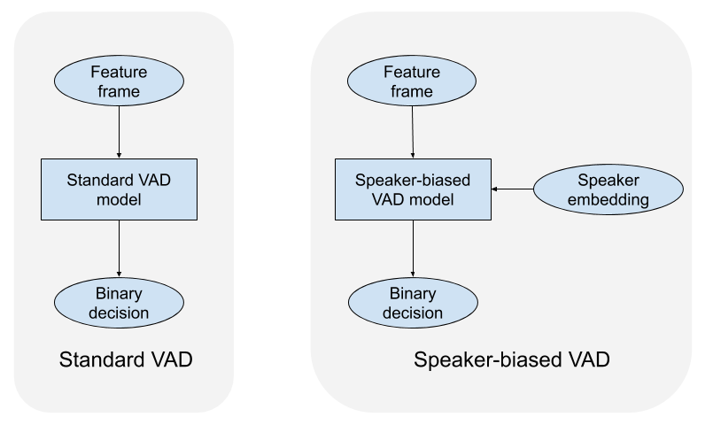
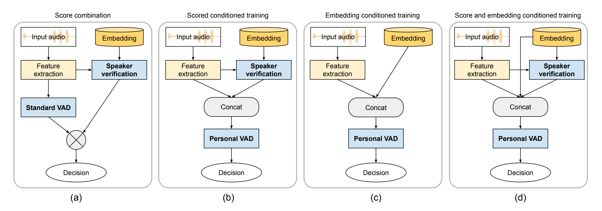

# Personal VAD (Speaker-Conditioned Voice Activity Detection)

[](https://github.com/wq2012/personal_vad/actions/workflows/pythonapp.yml)
[](https://pypi.org/project/personal-vad/)
[](https://pypi.org/project/personal-vad/)
[](https://www.pepy.tech/projects/personal-vad)

## Introduction

This repository provides a standalone, open-source Python implementation of
**Personal VAD 1.0** and **Personal VAD 2.0** based on the Odyssey 2020 and
Interspeech 2022 papers:

> **Personal VAD: Speaker-Conditioned Voice Activity Detection**
> *Shaojin Ding, Quan Wang, Shuo-yiin Chang, Li Wan, Ignacio Lopez Moreno*
> Paper: [https://arxiv.org/pdf/1908.04284](https://arxiv.org/pdf/1908.04284) | Blog / Demo Page: [https://google.github.io/speaker-id/publications/PersonalVAD/](https://google.github.io/speaker-id/publications/PersonalVAD/)

> **Personal VAD 2.0: Optimizing Personal Voice Activity Detection for On-Device Speech Recognition**
> *Shaojin Ding, Rajeev Rikhye, Qiao Liang, Yanzhang He, Quan Wang, Arun Narayanan, Patrick O'Neill, Ian McGraw*
> Paper: [https://arxiv.org/pdf/2204.03793](https://arxiv.org/pdf/2204.03793)

**Personal VAD** detects frame-level voice activity of a specific **target
speaker** in multi-speaker and noisy acoustic environments, serving as a
lightweight on-device gatekeeper before downstream speech recognition (ASR).
Unlike standard VAD, which classifies each audio frame into two classes
(`Speech` vs. `Silence`), Personal VAD classifies each frame into three classes:

- **`0`: `SPEECH` (`tss`)** — Target Speaker Speech
- **`1`: `SILENCE` (`ns`)** — Non-Speech / Silence
- **`2`: `SPEECH_FROM_NON_TARGET_SPEAKER` (`ntss`)** — Non-Target Speaker Speech

<p align="center">
  
</p>

---

## Architecture & Features

<p align="center">
  
</p>

1. **Acoustic Frontends** (`personal_vad.frontend`):
   - **Personal VAD 1.0**: 40-dimensional log-Mel filterbank energies (25ms
     window, 10ms step).
   - **Personal VAD 2.0**: 128-dimensional log-Mel filterbank energies (32ms
     window, 10ms step) stacked with 3 left-context frames and subsampled by a
     factor of 3 (producing 512-dimensional features at a 30ms frame rate),
     compatible with both pure TensorFlow (`tf.signal`) and Lingvo's
     `MelAsrFrontend`.
2. **Speaker Conditioning Modes** (`personal_vad.configs.ConditioningMode`):
   - **Personal VAD 1.0**:
     - `SC` (Score Combination baseline): Combines a standard 2-class VAD with
       frame-level speaker verification cosine similarity rescaled via online
       5th/95th histogram percentiles (`OnlinePercentileValue`).
     - `ST` (Score-Conditioned Training): Concatenates acoustic features and
       frame-level cosine similarity `[x_t, s_t]`.
     - `ET` (Embedding-Conditioned Training): Concatenates acoustic features and
       target speaker d-vector `[x_t, e_target]`.
     - `SET` (Score and Embedding Conditioned Training): Concatenates
       `[x_t, e_target, s_t]`.
   - **Personal VAD 2.0**:
     - `CONCAT`: Input concatenation `[x_t, e_target]`.
     - `FILM_DVECTOR` (Architecture E1): Feature-wise Linear Modulation (FiLM)
       after the Conformer/LSTM backbone using the target speaker d-vector
       `e_target`.
     - `FILM_COS` (Architecture E2): A 2-layer Conformer **Speaker Pre-Net**
       predicts frame-level speaker embeddings `e_prenet`, computes cosine
       similarity `s_t = cos(e_prenet, e_target)`, and modulates the main
       Conformer output via FiLM.
     - `CONCAT_COS`: Concatenates the Speaker Pre-Net cosine similarity `s_t`
       with the backbone output before the linear classifier.
     - `FILM_DVECTOR_COS` (Architecture E3): Concatenates both `[e_target, s_t]`
       and feeds the combined vector into the FiLM layer.
3. **Backbone Architectures** (`personal_vad.model`):
   - `LSTM_V1`: 2-layer unidirectional LSTM (64 units) + 64-unit ReLU FC +
     linear classifier (~130K parameters).
   - `LSTM_V2`: 256-unit ReLU input FC + 3-layer Layer-Normalized unidirectional
     LSTM (256 units) + linear classifier.
   - `CONFORMER`: 4-layer causal streaming Conformer (`model_dim=64`,
     `num_heads=8`, `left_context=31`, `right_context=0`, `kernel_size=7`,
     `ffn_multiplier=8`), supporting both full-sequence training and stateful
     frame-by-frame streaming inference (`stream_step`).
4. **Weighted Pairwise Loss** (`personal_vad.loss.WeightedPairwiseLoss`):
   - Prioritizes `<tss, ns>` and `<tss, ntss>` decision boundaries over
     `<ns, ntss>` (default weights `{(0, 1): 1.0, (0, 2): 1.0, (1, 2): 0.1}`).
5. **Joint Enrolled & Enrollment-less Training** (`personal_vad.dataset`):
   - Multi-speaker utterance concatenation (`concat_utterance_sequence`,
     `concat_utterance_group`) and Algorithm 1 from Personal VAD 2.0
     (`apply_enrollment_less_conditioning`: with probability `p_0 = 0.2`,
     replaces `e_target` with a zero vector `0` and maps `ntss` labels to `tss`
     so a single model seamlessly operates as both Personal VAD and Standard
     VAD).
6. **Evaluation & TFLite Export** (`personal_vad.eval_lib`,
   `personal_vad.tflite_export`):
   - Computes per-class Accuracy, overall Accuracy, per-class Average Precision
     (AP), micro-averaged mean Average Precision (mAP), ROC AUC, PR/ROC curve
     plots, and HTML reports.
   - Exports models to TensorFlow Lite (`.tflite`) with 8-bit dynamic-range
     post-training quantization.

---

## Installation

Install from PyPI:

```bash
pip3 install personal-vad
```

Or install from source:

```bash
git clone https://github.com/wq2012/personal_vad.git
cd personal_vad
pip3 install -r requirements.txt
pip3 install -e .
```

---

## Quick Start (Python API)

```python
import numpy as np
import personal_vad

# 1. Configure a Personal VAD 2.0 Streaming Conformer with FiLM + Speaker PreNet
config = personal_vad.ModelConfig.pvad_v2_conformer(
    conditioning_mode=personal_vad.ConditioningMode.FILM_DVECTOR_COS
)
model = personal_vad.PersonalVadModel(config=config)

# 2. Extract 512-dim stacked log-Mel features from 16kHz audio
fe = personal_vad.LogMelFrontend(personal_vad.FrontendConfig.pvad_v2())
waveform = np.random.randn(1, 16000).astype(np.float32)  # 1 second at 16kHz
features = fe(waveform)  # shape: [1, 32, 512]
speaker_embedding = np.random.randn(1, 256).astype(np.float32)

# 3. Predict frame-level posterior probabilities [tss, ns, ntss]
probs = model.predict_proba(features, speaker_embedding=speaker_embedding)

# 4. Export to 8-bit quantized TFLite and run inference
tflite_bytes = personal_vad.export_to_tflite(
    model, output_path="pvad_v2_int8.tflite", quantize=True, sequence_length=32
)
runner = personal_vad.TFLitePersonalVadRunner(tflite_bytes)
tflite_probs = runner.predict(features.numpy()[0], speaker_embedding[0])
```

---

## Command-Line Scripts

### 1. Prepare Multi-Speaker Concatenated Dataset

```bash
python3 scripts/prepare_dataset.py \
  --generate_synthetic \
  --num_utterances 100 \
  --frontend_version v1 \
  --min_utterances 1 \
  --max_utterances 3 \
  --output_npz data/train_concat.npz
```

### 2. Train Personal VAD Model

```bash
python3 scripts/train.py \
  --train_npz data/train_concat.npz \
  --checkpoint_dir checkpoints/pvad_v1_et \
  --backbone lstm_v1 \
  --conditioning_mode et \
  --loss_type weighted_pairwise \
  --enrollment_less_prob 0.2 \
  --epochs 10 \
  --learning_rate 5e-5
```

### 3. Evaluate Model and Generate HTML/JSON Report

```bash
python3 scripts/evaluate.py \
  --eval_npz data/train_concat.npz \
  --checkpoint_dir checkpoints/pvad_v1_et \
  --eval_mode personal_vad \
  --output_dir eval_results/
```

### 4. Export Model to Quantized TFLite

```bash
python3 scripts/export_tflite.py \
  --checkpoint_dir checkpoints/pvad_v1_et \
  --sequence_length 32 \
  --output_tflite checkpoints/pvad_v1_et/model_int8.tflite
```

---

## Published Paper Results

### Personal VAD 1.0 (Paper Table 1 & Table 2, [arXiv:1908.04284](https://arxiv.org/pdf/1908.04284))

Average Precision (AP) and micro-averaged mAP on concatenated LibriSpeech test
sets under clean and noisy conditions:

| Conditioning Mode | Loss Function | Parameters | `tss` AP | `ns` AP | `ntss` AP | Weighted `mAP` |
| :--- | :--- | :---: | :---: | :---: | :---: | :---: |
| **SC** *(Score Combination)* | Cross-Entropy | 0.08M + 1.1M | 0.808 | 0.909 | 0.785 | 0.831 |
| **ST** *(Score-Conditioned)* | Cross-Entropy | 0.08M + 1.1M | 0.871 | 0.916 | 0.869 | 0.884 |
| **ET** *(Embedding-Conditioned)* | Cross-Entropy | **0.13M** | 0.916 | 0.918 | 0.922 | 0.919 |
| **SET** *(Score + Embedding)* | Cross-Entropy | 0.13M + 1.1M | 0.912 | 0.919 | 0.919 | 0.916 |
| **ET** *(Embedding-Conditioned)* | **Weighted Pairwise** | **0.13M** | **0.920** | **0.919** | **0.923** | **0.921** |

### Personal VAD 2.0 (Paper Table 1 & Table 2, [arXiv:2204.03793](https://arxiv.org/pdf/2204.03793))

Comparison of backbone architectures and speaker conditioning methods in
Personal VAD 2.0 (8-bit quantized TFLite):

| Model ID | Backbone | Speaker Conditioning | Model Size | `tss` AP | `ns` AP | `ntss` AP | `mAP` |
| :--- | :--- | :--- | :---: | :---: | :---: | :---: | :---: |
| **B1** | 3-Layer LSTM (256d) | Input Concat (`CONCAT`) | 1.9 MB | 0.903 | 0.885 | 0.901 | 0.901 |
| **B2** | 4-Layer Conformer (64d) | Input Concat (`CONCAT`) | 370 KB | 0.868 | 0.885 | 0.858 | 0.873 |
| **E1** | 4-Layer Conformer (64d) | FiLM on d-vector (`FILM_DVECTOR`) | **200 KB** | 0.909 | 0.883 | 0.905 | 0.908 |
| **E2** | 4-Layer Conformer (64d) | Speaker Pre-Net + FiLM (`FILM_COS`) | 328 KB | 0.910 | 0.885 | 0.905 | 0.908 |
| **E3** | 4-Layer Conformer (64d) | Speaker Pre-Net + d-vector FiLM (`FILM_DVECTOR_COS`) | 328 KB | **0.911** | **0.886** | **0.906** | **0.909** |

---

## Running Unit Tests

To run the full test suite locally:

```bash
bash run_tests.sh
```

---

## Citations

If you use this library in your research, please cite the Personal VAD papers:

- **Personal VAD: Speaker-Conditioned Voice Activity Detection** ([arXiv:1908.04284](https://arxiv.org/pdf/1908.04284))
  ```bibtex
  @inproceedings{ding2020personal,
    title={Personal {VAD}: Speaker-Conditioned Voice Activity Detection},
    author={Ding, Shaojin and Wang, Quan and Chang, Shuo-yiin and Wan, Li and Moreno, Ignacio Lopez},
    booktitle={Proc. Odyssey The Speaker and Language Recognition Workshop},
    pages={433--439},
    year={2020}
  }
  ```

- **Personal VAD 2.0: Optimizing Personal Voice Activity Detection for On-Device Speech Recognition** ([arXiv:2204.03793](https://arxiv.org/pdf/2204.03793))
  ```bibtex
  @inproceedings{ding2022personal,
    title={Personal {VAD} 2.0: Optimizing Personal Voice Activity Detection for On-Device Speech Recognition},
    author={Ding, Shaojin and Rikhye, Rajeev and Liang, Qiao and He, Yanzhang and Wang, Quan and Narayanan, Arun and O'Neill, Patrick and McGraw, Ian},
    booktitle={Proc. Interspeech},
    pages={3744--3748},
    year={2022}
  }
  ```
